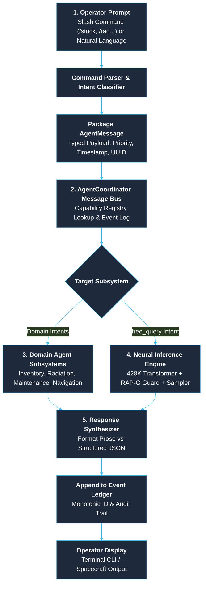
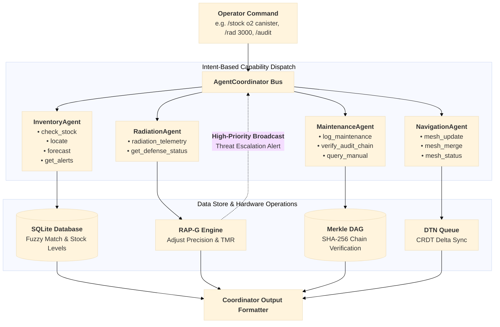
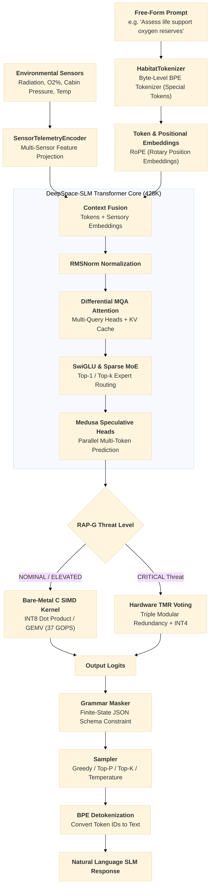

# DeepSpace-SLM: End-to-End Prompt Dataflow

This document details the lifecycle of an operator query through **DeepSpace-SLM**, tracing data movement from initial prompt ingestion, multi-agent bus dispatching, neural transformer passes, radiation defense guarding, and verified output delivery.

---

## 1. High-Level Pipeline Overview

The macro dataflow from user input to final displayed response:



---

## 2. Multi-Agent Dispatch & Routing Dataflow

How operational commands are routed through the message bus to domain agents:



---

## 3. Neural Inference Engine Dataflow (SLM Backbone)

The detailed forward pass when a free-form language prompt is routed to `InferenceAgent`:



---

## 4. Stage-by-Stage Lifecycle Walkthrough

### Stage 1: Input Ingestion & Packaging
- **Ingress**: Operators submit commands via the interactive CLI, mission scripts, or API endpoints.
- **Parsing**:
  - Slash commands (`/stock`, `/locate`, `/forecast`, `/alerts`, `/manual`, `/rad`, `/mesh`, `/audit`) are parsed into specific operational intents.
  - Free-form text questions are tagged with intent `free_query`.
- **Packaging**: Encapsulated into a typed `AgentMessage`:
  ```python
  AgentMessage(
      sender="user",
      intent="check_stock",
      payload={"item": "o2 canister"},
      priority=MessagePriority.NORMAL,
      trace_id="4f9c1b...",
  )
  ```

### Stage 2: Coordinator Bus Routing
- The `AgentCoordinator` queries its internal **Capability Registry**.
- Looks up the registered agent responsible for the message intent:
  - `check_stock`, `locate`, `forecast` $\rightarrow$ `InventoryAgent`
  - `radiation_telemetry`, `get_defense_status` $\rightarrow$ `RadiationAgent`
  - `log_maintenance`, `verify_audit_chain` $\rightarrow$ `MaintenanceAgent`
  - `mesh_update`, `mesh_status` $\rightarrow$ `NavigationAgent`
  - `free_query`, `perplexity` $\rightarrow$ `InferenceAgent`
- If an agent flags an event with `broadcast=True` (e.g., critical cosmic radiation spike), the coordinator replicates the message across all registered peer agents.

### Stage 3: Domain Subsystem Operations
- **InventoryAgent**: Queries local SQLite tables using fuzzy string matching, computes consumption depletion timelines, and updates quantities.
- **RadiationAgent**: Ingests space dosimetry telemetry ($\mu\text{Gy/h}$), updates threat thresholds (`NOMINAL`, `ELEVATED`, `CRITICAL`), and triggers model defense adaptation.
- **MaintenanceAgent**: Searches offline procedure manuals and commits SHA-256 blocks to the tamper-evident Merkle DAG.
- **NavigationAgent**: Manages Delay-Tolerant Networking (DTN) store-and-forward bundle queues and reconciles CRDT state across spacecraft modules.

### Stage 4: Neural Forward Pass (SLM Backbone)
- **Tokenization**: `HabitatTokenizer` encodes text into Byte-Level BPE subword token IDs.
- **Sensor Fusion**: Environmental telemetry is projected via `SensorTelemetryEncoder` and fused into the context.
- **Transformer Forward Pass**:
  - Pre-layer RMSNorm normalization.
  - Differential Multi-Query Attention (MQA) with persistent Key-Value cache.
  - Rotary Position Embeddings (RoPE).
  - SwiGLU non-linearities and Sparse Mixture-of-Experts (MoE) routing.
  - Medusa auxiliary heads for speculative multi-token decoding.
- **Hardware Defense & SIMD**:
  - Under normal conditions: AVX2/SIMD bare-metal C vector runtime (37.26 GOPS INT8).
  - Under radiation storms: INT4 quantization with Triple Modular Redundancy (TMR median voting) and ECC memory scrubbing.
- **Constrained Decoding**:
  - Finite-state grammar masking to enforce structured JSON output when requested.
  - Autoregressive sampling and BPE detokenization.

### Stage 5: Response Synthesis & Delivery
- **Aggregation**: The `AgentCoordinator` captures the `AgentResponse`.
- **Mode Formatting**: Outputs in either **Conversational Prose Mode** or **Machine Structured JSON Mode**.
- **Audit Logging**: Stamped with a monotonic transaction ID and recorded in the coordinator's event ledger.
